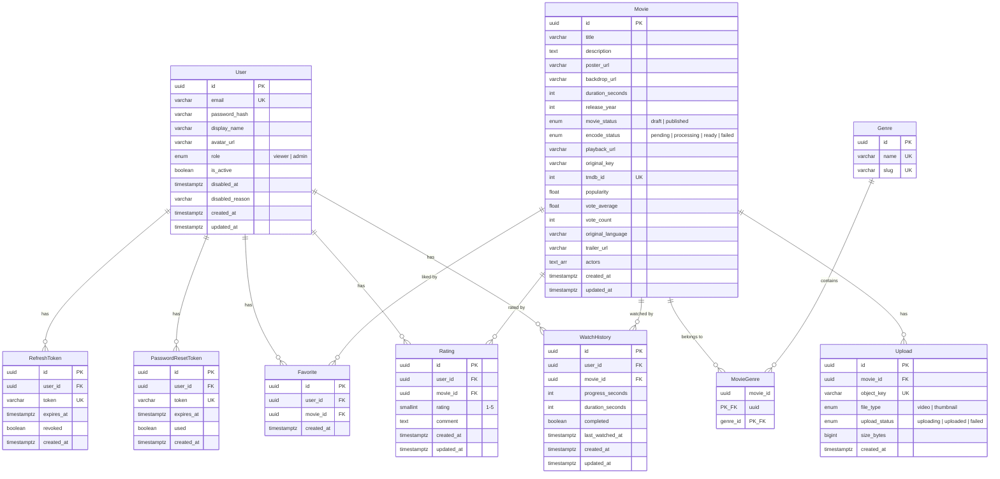

# NETFLAT — Database Schema

> **Database:** PostgreSQL · **ORM:** Prisma  
> **Schema file:** [`apps/api/prisma/schema.prisma`](file:///d:/LapTrinh/Netflat/apps/api/prisma/schema.prisma)  
> **Cập nhật lần cuối:** 2026-03-19

---

## Sơ đồ quan hệ (ER Diagram)

---

## Enums

| Enum | Giá trị | Mô tả |
|------|---------|-------|
| `UserRole` | `viewer`, `admin` | Phân quyền người dùng |
| `MovieStatus` | `draft`, `published` | Trạng thái xuất bản phim |
| `EncodeStatus` | `pending`, `processing`, `ready`, `failed` | Trạng thái encode HLS |
| `UploadFileType` | `video`, `thumbnail` | Loại file upload |
| `UploadStatus` | `uploading`, `uploaded`, `failed` | Trạng thái upload |

---

## Chi tiết từng bảng

### 1. `users` — Người dùng

| Cột | Kiểu | Ràng buộc | Mô tả |
|-----|------|-----------|-------|
| `id` | UUID | PK | ID tự sinh |
| `email` | VARCHAR(255) | UNIQUE, NOT NULL | Email đăng nhập |
| `password_hash` | VARCHAR(255) | NOT NULL | Mật khẩu đã hash (bcrypt) |
| `display_name` | VARCHAR(100) | NULL | Tên hiển thị |
| `avatar_url` | VARCHAR(1000) | NULL | URL ảnh đại diện |
| `role` | UserRole | DEFAULT `viewer` | Vai trò: viewer hoặc admin |
| `is_active` | BOOLEAN | DEFAULT `true` | Tài khoản còn hoạt động? |
| `disabled_at` | TIMESTAMPTZ | NULL | Thời điểm bị vô hiệu hóa |
| `disabled_reason` | VARCHAR(500) | NULL | Lý do vô hiệu hóa |
| `created_at` | TIMESTAMPTZ | DEFAULT `now()` | Ngày tạo |
| `updated_at` | TIMESTAMPTZ | Auto | Ngày cập nhật |

**Quan hệ:** Cha của `refresh_tokens`, `password_reset_tokens`, `favorites`, `ratings`, `watch_history`

---

### 2. `movies` — Phim

| Cột | Kiểu | Ràng buộc | Mô tả |
|-----|------|-----------|-------|
| `id` | UUID | PK | ID tự sinh |
| `title` | VARCHAR(500) | NOT NULL | Tên phim |
| `description` | TEXT | NULL | Mô tả nội dung |
| `poster_url` | VARCHAR(1000) | NULL | URL poster |
| `backdrop_url` | VARCHAR(1000) | NULL | URL backdrop |
| `duration_seconds` | INT | NULL | Thời lượng (giây) |
| `release_year` | INT | NULL | Năm phát hành |
| `movie_status` | MovieStatus | DEFAULT `draft` | Trạng thái xuất bản |
| `encode_status` | EncodeStatus | DEFAULT `pending` | Trạng thái encode |
| `playback_url` | VARCHAR(1000) | NULL | URL phát HLS (master.m3u8) |
| `original_key` | VARCHAR(500) | NULL | S3 key file gốc |
| `tmdb_id` | INT | UNIQUE, NULL | ID từ TMDb API |
| `popularity` | FLOAT | DEFAULT `0` | Điểm phổ biến (TMDb) |
| `vote_average` | FLOAT | DEFAULT `0` | Điểm trung bình (TMDb) |
| `vote_count` | INT | DEFAULT `0` | Số lượt vote (TMDb) |
| `original_language` | VARCHAR(10) | NULL | Ngôn ngữ gốc |
| `trailer_url` | VARCHAR(500) | NULL | URL trailer YouTube |
| `actors` | TEXT[] | DEFAULT `[]` | Danh sách tên diễn viên |
| `created_at` | TIMESTAMPTZ | DEFAULT `now()` | Ngày tạo |
| `updated_at` | TIMESTAMPTZ | Auto | Ngày cập nhật |

**Indexes:**
- `idx_movies_status` → `(movie_status, encode_status)` — lọc phim theo trạng thái
- `idx_movies_created_at` → `(created_at DESC)` — sắp xếp mới nhất
- `(release_year)` — lọc theo năm
- `(title)` — tìm kiếm theo tên

**Quan hệ:** Cha của `movie_genres`, `favorites`, `uploads`, `ratings`, `watch_history`

> **Ghi chú:** Cột `actors` lưu dạng mảng chuỗi (`String[]`) thay vì bảng quan hệ riêng. Phù hợp cho hiển thị nhanh, nhưng không hỗ trợ query ngược ("diễn viên X đóng phim nào").

---

### 3. `genres` — Thể loại phim

| Cột | Kiểu | Ràng buộc | Mô tả |
|-----|------|-----------|-------|
| `id` | UUID | PK | ID tự sinh |
| `name` | VARCHAR(100) | UNIQUE, NOT NULL | Tên thể loại (VD: "Action") |
| `slug` | VARCHAR(100) | UNIQUE, NOT NULL | Slug URL-friendly (VD: "action") |

---

### 4. `movie_genres` — Liên kết Phim ↔ Thể loại (N:N)

| Cột | Kiểu | Ràng buộc | Mô tả |
|-----|------|-----------|-------|
| `movie_id` | UUID | PK, FK → `movies.id` | ID phim |
| `genre_id` | UUID | PK, FK → `genres.id` | ID thể loại |

**Composite PK:** `(movie_id, genre_id)`  
**Index:** `(genre_id)` — tìm phim theo thể loại  
**On Delete:** CASCADE cả hai chiều

---

### 5. `favorites` — Phim yêu thích

| Cột | Kiểu | Ràng buộc | Mô tả |
|-----|------|-----------|-------|
| `id` | UUID | PK | ID tự sinh |
| `user_id` | UUID | FK → `users.id` | Người dùng |
| `movie_id` | UUID | FK → `movies.id` | Phim |
| `created_at` | TIMESTAMPTZ | DEFAULT `now()` | Ngày thêm |

**Unique:** `(user_id, movie_id)` — mỗi user chỉ thích 1 phim 1 lần  
**On Delete:** CASCADE

---

### 6. `uploads` — File upload (video/thumbnail)

| Cột | Kiểu | Ràng buộc | Mô tả |
|-----|------|-----------|-------|
| `id` | UUID | PK | ID tự sinh |
| `movie_id` | UUID | FK → `movies.id` | Phim liên quan |
| `object_key` | VARCHAR(500) | UNIQUE, NOT NULL | S3 object key |
| `file_type` | UploadFileType | NOT NULL | Loại: video hoặc thumbnail |
| `upload_status` | UploadStatus | DEFAULT `uploading` | Trạng thái upload |
| `size_bytes` | BIGINT | NULL | Kích thước file (bytes) |
| `created_at` | TIMESTAMPTZ | DEFAULT `now()` | Ngày tạo |

**On Delete:** CASCADE

---

### 7. `ratings` — Đánh giá phim

| Cột | Kiểu | Ràng buộc | Mô tả |
|-----|------|-----------|-------|
| `id` | UUID | PK | ID tự sinh |
| `user_id` | UUID | FK → `users.id` | Người đánh giá |
| `movie_id` | UUID | FK → `movies.id` | Phim được đánh giá |
| `rating` | SMALLINT | NOT NULL | Số sao (1–5) |
| `comment` | TEXT | NULL | Bình luận kèm theo |
| `created_at` | TIMESTAMPTZ | DEFAULT `now()` | Ngày tạo |
| `updated_at` | TIMESTAMPTZ | Auto | Ngày cập nhật |

**Unique:** `(user_id, movie_id)` — mỗi user chỉ đánh giá 1 phim 1 lần  
**On Delete:** CASCADE

---

### 8. `watch_history` — Lịch sử xem phim

| Cột | Kiểu | Ràng buộc | Mô tả |
|-----|------|-----------|-------|
| `id` | UUID | PK | ID tự sinh |
| `user_id` | UUID | FK → `users.id` | Người xem |
| `movie_id` | UUID | FK → `movies.id` | Phim đã xem |
| `progress_seconds` | INT | DEFAULT `0` | Tiến trình xem (giây) |
| `duration_seconds` | INT | DEFAULT `0` | Tổng thời lượng (giây) |
| `completed` | BOOLEAN | DEFAULT `false` | Đã xem hết? |
| `last_watched_at` | TIMESTAMPTZ | DEFAULT `now()` | Lần xem cuối |
| `created_at` | TIMESTAMPTZ | DEFAULT `now()` | Ngày tạo |
| `updated_at` | TIMESTAMPTZ | Auto | Ngày cập nhật |

**Unique:** `(user_id, movie_id)` — mỗi user chỉ có 1 bản ghi/phim  
**Index:** `(user_id, last_watched_at DESC)` — hiển thị "xem gần đây"  
**On Delete:** CASCADE

---

### 9. `refresh_tokens` — Token làm mới JWT

| Cột | Kiểu | Ràng buộc | Mô tả |
|-----|------|-----------|-------|
| `id` | UUID | PK | ID tự sinh |
| `user_id` | UUID | FK → `users.id` | Chủ token |
| `token` | VARCHAR(512) | UNIQUE, NOT NULL | Giá trị token |
| `expires_at` | TIMESTAMPTZ | NOT NULL | Thời hạn |
| `revoked` | BOOLEAN | DEFAULT `false` | Đã thu hồi? |
| `created_at` | TIMESTAMPTZ | DEFAULT `now()` | Ngày tạo |

**On Delete:** CASCADE

---

### 10. `password_reset_tokens` — Token đặt lại mật khẩu

| Cột | Kiểu | Ràng buộc | Mô tả |
|-----|------|-----------|-------|
| `id` | UUID | PK | ID tự sinh |
| `user_id` | UUID | FK → `users.id` | Người yêu cầu reset |
| `token` | VARCHAR(512) | UNIQUE, NOT NULL | Giá trị token |
| `expires_at` | TIMESTAMPTZ | NOT NULL | Thời hạn |
| `used` | BOOLEAN | DEFAULT `false` | Đã sử dụng? |
| `created_at` | TIMESTAMPTZ | DEFAULT `now()` | Ngày tạo |

**On Delete:** CASCADE

---

## Quy tắc chung

| Quy tắc | Chi tiết |
|----------|----------|
| **Primary Key** | Tất cả dùng UUID v4, trừ `movie_genres` dùng composite PK |
| **Naming** | Prisma camelCase → DB snake_case (qua `@map`) |
| **Timestamps** | Luôn dùng `TIMESTAMPTZ` (timezone-aware) |
| **Soft Delete** | Không có — tất cả dùng hard delete với CASCADE |
| **On Delete** | Mọi FK đều CASCADE — xóa cha sẽ xóa con |
| **Actors** | Lưu dạng `String[]` trên bảng `movies`, không có bảng riêng |
