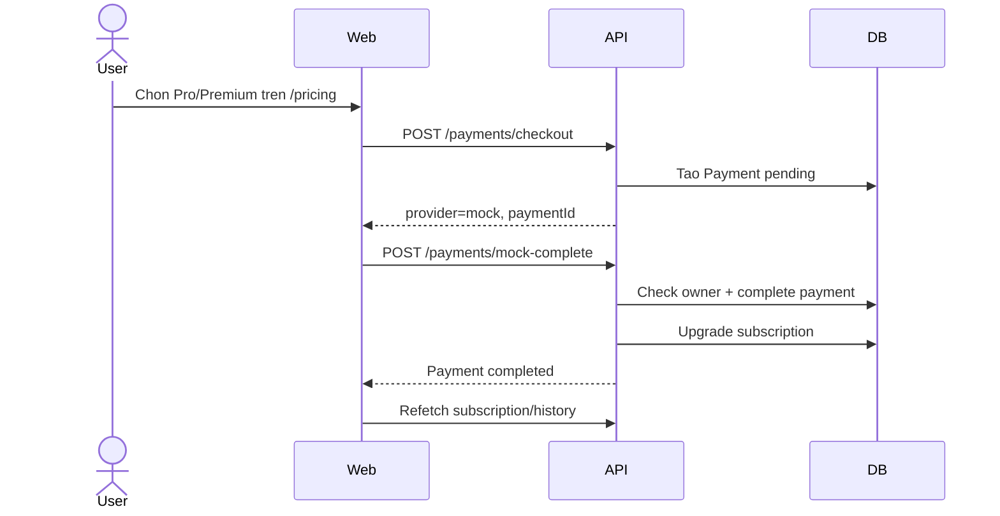
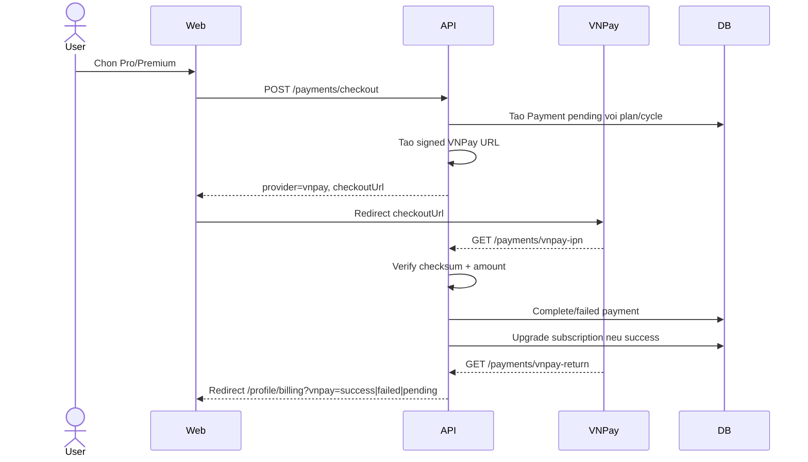

# Chuc Nang Goi Cuoc Va Thanh Toan Netflat

Tai lieu nay mo ta chi tiet phan giai phap goi cuoc va thanh toan da duoc phat trien cho Netflat, bao gom backend API, vong doi subscription, mock payment, VNPay sandbox, frontend billing UX, scheduler, email va admin API.

## 1. Trang thai hien tai

Chuc nang billing/payment hien tai da co the dung cho demo va staging voi hai che do:

- `PAYMENT_PROVIDER=mock`: thanh toan mo phong noi bo, dung cho demo nhanh va test tu dong.
- `PAYMENT_PROVIDER=vnpay`: tao URL thanh toan VNPay sandbox/that, xac thuc checksum, xu ly IPN va Return URL.

Mock payment van duoc giu de demo noi bo khi chua cau hinh VNPay. VNPay da duoc tich hop theo huong provider that, nhung viec giao dich co thuc su thanh cong ngoai ngan hang phu thuoc vao credential sandbox/production va IPN public URL.

## 2. Cac goi cuoc

Plan duoc luu trong bang `subscription_plans` va seed tu `apps/api/prisma/seed.ts`.

| Goi | Gia thang | Gia nam | Gioi han phim/thang | Chat luong toi da | Yeu thich | Thiet bi | Quang cao |
| --- | ---: | ---: | ---: | --- | ---: | ---: | --- |
| Free | 0 VND | 0 VND | 5 | 480p | 10 | 1 | Co |
| Pro | 139.000 VND | 1.390.000 VND | 9999 | 1080p | 100 | 2 | Khong |
| Premium | 299.000 VND | 2.990.000 VND | 9999 | 4K | 200 | 4 | Khong |

Quyen loi plan dang duoc dung trong cac luong:

- `maxMoviesPerMonth`: kiem tra quota xem phim moi thang.
- `maxQualityResolution`: gioi han danh sach chat luong HLS tra ve cho player.
- `maxFavorites`, `maxDevices`, `showAds`: da co trong schema/API va hien thi tren pricing/billing, mot so logic enforcement co the bo sung tiep tuy nhu cau.

## 3. Database va schema

### Bang `SubscriptionPlan`

Luu thong tin dinh nghia goi:

- `name`: `free`, `pro`, `premium`.
- `displayName`, `description`.
- `maxMoviesPerMonth`, `maxQualityResolution`, `maxFavorites`, `maxDevices`, `showAds`.
- `monthlyPrice`, `annualPrice`.
- `isActive`.

### Bang `Subscription`

Moi user co mot subscription hien tai:

- `userId` unique.
- `planId`.
- `status`: `active | canceled | expired`.
- `startDate`, `endDate`.
- `autoRenew`.

Chinh sach huy goi dang la cuoi ky: user huy Pro/Premium thi `status=canceled`, `autoRenew=false`, nhung van dung duoc den het `endDate`.

### Bang `Payment`

Payment luu lich su giao dich va metadata provider:

- `paymentMethod`: `mock` hoac `vnpay`.
- `planName`, `billingCycle`: luu muc tieu thanh toan ngay khi checkout, khong tin du lieu plan tu callback client.
- `status`: `pending | completed | failed | refunded`.
- `amount`, `currency`.
- `transactionId`.
- `providerReference`: unique, dung de lookup `vnp_TxnRef`.
- `providerTransactionId`, `providerResponseCode`, `providerTransactionStatus`.
- `providerPayload`: raw payload tu provider de debug/audit ky thuat.

Migration metadata VNPay nam o:

```text
apps/api/prisma/migrations/20260428143000_add_vnpay_payment_metadata/
```

## 4. Backend API

### Subscription API

| Method | Endpoint | Auth | Mo ta |
| --- | --- | --- | --- |
| `GET` | `/api/subscriptions/plans` | Khong | Lay danh sach goi dang active |
| `GET` | `/api/subscriptions/me` | Co | Lay subscription hien tai + usage thang hien tai |
| `POST` | `/api/subscriptions/upgrade` | Co | Chi cho phep chuyen ve Free truc tiep; goi tra phi phai qua checkout |
| `POST` | `/api/subscriptions/cancel` | Co | Huy gia han goi tra phi theo chinh sach cuoi ky |

### Payment API

| Method | Endpoint | Auth | Mo ta |
| --- | --- | --- | --- |
| `POST` | `/api/payments/checkout` | Co | Tao payment `pending`, goi provider tao checkout URL |
| `GET` | `/api/payments/history?page=&limit=` | Co | Lay lich su thanh toan co phan trang |
| `POST` | `/api/payments/mock-complete` | Co | Hoan tat mock payment trong dev/test, co check owner |
| `POST` | `/api/payments/mock-webhook` | Khong | Webhook mock, yeu cau `x-webhook-secret` |
| `GET` | `/api/payments/vnpay-ipn` | Public | VNPay server-to-server callback, verify checksum va cap nhat DB |
| `GET` | `/api/payments/vnpay-return` | Public | VNPay redirect browser ve API, verify checksum roi redirect ve billing page |

### Admin billing API

Tat ca endpoint admin yeu cau JWT va role `admin`.

| Method | Endpoint | Mo ta |
| --- | --- | --- |
| `GET` | `/api/admin/billing/stats` | Tong doanh thu completed, doanh thu theo plan, subscription count theo plan/status, 10 payment gan nhat |
| `GET` | `/api/admin/subscriptions?page=&limit=&planName=&status=` | Danh sach subscription co filter va phan trang |
| `PATCH` | `/api/admin/subscriptions/:userId/plan` | Admin override plan, bat buoc `reason`, khong tao payment |

Admin override hien ghi log bang `Logger`. Chua co bang audit rieng.

## 5. Payment provider architecture

Backend dung interface `PaymentProvider` de tach logic provider ra khoi `PaymentsService`.

```ts
export interface PaymentProvider {
  readonly name: string;
  createCheckoutSession(params): Promise<CheckoutSession>;
  verifyWebhookSignature(payload, signature?): boolean;
  parseWebhookEvent(payload): Promise<WebhookEvent>;
}
```

`PaymentsModule` chon provider theo env:

- `PAYMENT_PROVIDER=mock` -> `MockPaymentProvider`.
- `PAYMENT_PROVIDER=vnpay` -> `VnpayPaymentProvider`.

`PaymentsService` giu vai tro orchestrator:

1. Validate plan active.
2. Tao payment `pending`.
3. Goi provider tao checkout session.
4. Luu `providerReference`.
5. Xu ly callback/webhook.
6. Complete/fail payment.
7. Upgrade subscription neu payment completed.
8. Gui email thanh cong.

Cach thiet ke nay giup them provider moi sau nay ma khong phai viet lai luong subscription.

## 6. Mock payment

Mock provider phuc vu dev/test/staging demo.

### Checkout mock

`POST /api/payments/checkout` voi provider mock:

1. Tao payment `pending`.
2. Tra ve `checkoutUrl` noi bo dang `/billing/mock-checkout?paymentId=...`.
3. Frontend hien tai tu dong goi `mock-complete` sau khi checkout neu provider la `mock`.

### Bao mat mock payment

Da bo sung cac diem an toan:

- `mock-complete` yeu cau auth.
- Controller lay user tu JWT bang `@CurrentUser()`.
- Service kiem tra `payment.userId === user.id`.
- Neu user khac co tinh complete payment khong thuoc minh thi tra `ForbiddenException` voi code `PAYMENT_ACCESS_DENIED`.
- `mock-webhook` yeu cau header `x-webhook-secret`.
- Secret duoc so sanh voi `MOCK_WEBHOOK_SECRET`.

Mock webhook chi nen dung cho test/backend-to-backend, khong nen goi truc tiep tu frontend production/staging UX.

## 7. VNPay payment

VNPay provider dung `crypto` built-in, khong them dependency thanh toan ngoai.

### Tao URL thanh toan

Khi `PAYMENT_PROVIDER=vnpay`, checkout tao URL toi VNPay voi cac tham so chinh:

- `vnp_Version=2.1.0`
- `vnp_Command=pay`
- `vnp_TmnCode`
- `vnp_Amount=amount * 100`
- `vnp_CurrCode=VND`
- `vnp_TxnRef`
- `vnp_OrderInfo`
- `vnp_OrderType=other`
- `vnp_ReturnUrl`
- `vnp_IpAddr`
- `vnp_CreateDate`
- `vnp_ExpireDate`
- `vnp_Locale=vn`
- `vnp_SecureHash`

Chu ky duoc tao bang HMAC-SHA512:

1. Bo qua cac field rong.
2. Sort key tang dan.
3. Encode query string theo format VNPay.
4. Ky bang `VNPAY_HASH_SECRET`.
5. Them `vnp_SecureHash` vao URL.

`vnp_TxnRef` duoc sinh tu `paymentId` bo dau gach ngang va luu vao `providerReference`.

### IPN

`GET /api/payments/vnpay-ipn` la endpoint server-to-server cho VNPay.

Luong xu ly:

1. Chi xu ly khi provider hien tai la `vnpay`.
2. Verify `vnp_SecureHash`.
3. Parse event.
4. Lookup payment bang `vnp_TxnRef`/`providerReference`.
5. Kiem tra amount tu VNPay co khop payment amount.
6. Neu payment khong con `pending`, tra idempotent response `RspCode=02`.
7. Neu `vnp_ResponseCode=00` va `vnp_TransactionStatus=00`, complete payment va upgrade subscription.
8. Neu failed/cancel, update payment `failed`.

Ma response chinh:

- `00`: Confirm Success.
- `97`: Invalid Checksum.
- `01`: Order not Found.
- `04`: Invalid Amount.
- `02`: Order already confirmed.
- `99`: Loi chung/provider khong dung.

### Return URL

`GET /api/payments/vnpay-return` la endpoint browser redirect sau khi user thanh toan.

Luong xu ly:

1. Verify checksum.
2. Parse response.
3. Lookup payment bang `providerReference`.
4. Kiem tra amount.
5. Neu payment da completed -> redirect ve `/profile/billing?vnpay=success`.
6. Neu payment pending va `VNPAY_ALLOW_RETURN_COMPLETION=true` trong `NODE_ENV=development` -> complete payment ngay tu Return URL de demo local.
7. Neu production/staging khong cho complete tu Return URL -> redirect `/profile/billing?vnpay=pending`, cho IPN cap nhat DB.
8. Neu loi -> redirect `/profile/billing?vnpay=failed`.

Local demo duoc ho tro vi VNPay IPN server-to-server khong the goi vao `localhost` neu khong co tunnel public.

## 8. Vong doi subscription

### Tao subscription mac dinh

`ensureUserSubscription(userId)` dam bao user luon co subscription. Neu chua co, he thong tao Free plan:

- `status=active`
- `autoRenew=true`
- `endDate` tinh theo annual default

### Lay subscription hieu luc

`getActiveSubscription(userId)`:

- Dam bao user co subscription.
- Neu la Free hoac subscription chua het han -> tra subscription hien tai.
- Neu goi tra phi da het han -> tra response voi plan Free, `status=expired`, `autoRenew=false` cho request hien tai.

Dieu nay giup stream/quota khong con dung quyen Pro/Premium khi subscription da het han, ngay ca truoc khi scheduler kip downgrade DB.

### Upgrade

`upgradePlan(userId, planName, billingCycle)`:

- Tim plan active.
- Tinh `endDate` theo monthly hoac annual.
- Upsert subscription.
- Set `status=active`, `autoRenew=true`.

Goi tra phi chi duoc upgrade sau payment completed. Endpoint `/api/subscriptions/upgrade` chan paid plan va chi cho phep chuyen Free truc tiep.

### Cancel

`cancelSubscription(userId)`:

- Khong cho huy Free.
- Khong cho huy subscription da het han.
- Voi Pro/Premium: set `status=canceled`, `autoRenew=false`.
- Giu nguyen `endDate`.
- Gui email thong bao da huy gia han.

User van dung goi tra phi den het `endDate`. Sau do scheduler downgrade ve Free.

### Downgrade expired

`downgradeExpiredSubscriptionToFree(subscriptionId)`:

- Neu subscription da la Free -> khong thay doi.
- Neu la paid plan het han -> chuyen sang Free, `status=active`, `autoRenew=true`, reset `startDate/endDate`.

## 9. Quota va streaming

`MoviesService.getStreamUrl()` dung `getActiveSubscription()` de lay plan hieu luc.

Luong chinh:

1. Kiem tra movie ton tai.
2. Kiem tra movie `published` va encode `ready`.
3. Lay subscription hieu luc.
4. Kiem tra quota thang bang `UsageService.canWatchMovie`.
5. Neu vuot quota -> `MONTHLY_LIMIT_EXCEEDED`.
6. Gioi han `qualityOptions` theo `maxQualityResolution`.
7. Tang `moviesWatched` khi tra stream URL.

Neu paid subscription da het han, request stream se dung quyen Free.

## 10. Scheduler va email

Da them `@nestjs/schedule` va `ScheduleModule.forRoot()` trong `AppModule`.

### Cron sap het han

`SubscriptionSchedulerService.handleExpiringSubscriptions()` chay moi ngay 08:00:

- Tim subscription paid co `endDate` trong 7 ngay toi.
- Bao gom `active` va `canceled`.
- Gui email nhac sap het han/gia han.

### Cron het han

`SubscriptionSchedulerService.handleExpiredSubscriptions()` chay moi ngay 00:00:

- Tim subscription paid da qua `endDate`.
- Goi `downgradeExpiredSubscriptionToFree`.
- Gui email thong bao da chuyen ve Free.

### Email da co

`MailService` ho tro:

- `sendPaymentSuccessEmail`
- `sendSubscriptionExpiringEmail`
- `sendSubscriptionExpiredEmail`
- `sendSubscriptionCanceledEmail`

Neu chua cau hinh SMTP, email duoc log ra console theo che do dev.

## 11. Frontend UX

### Trang `/pricing`

Tinh nang da co:

- Lay danh sach goi tu API.
- Chuyen monthly/annual.
- Hien badge tiet kiem khi annual co discount.
- Guest banner yeu cau dang nhap.
- Neu user chon Free -> goi API chuyen Free.
- Neu user chon Pro/Premium -> goi `/api/payments/checkout`.
- Neu provider la `mock` -> tu dong complete mock payment va invalidate subscription/payment cache.
- Neu provider la `vnpay` -> redirect browser sang `checkoutUrl`.

### Trang `/profile/billing`

Tinh nang da co:

- Hien goi hien tai.
- Hien trang thai `active`, `canceled`, `expired`.
- Hien `endDate`, usage thang hien tai, quality, max devices, auto-renew.
- Hien warning khi goi paid con <= 7 ngay.
- Nut "Huy gia han" khi paid plan dang `autoRenew=true`.
- Lich su thanh toan co phan trang `page`, `limit=20`.
- Doc query `vnpay=success|failed|pending` de hien thong bao sau redirect VNPay.
- Refetch subscription va payment history sau khi quay ve tu VNPay.

### React Query hooks

Da co hook:

- `useSubscriptionPlans`
- `useMySubscription`
- `useUpgradeSubscription`
- `useCreateCheckout`
- `useCompleteMockPayment`
- `useBillingHistory`
- `useCancelSubscription`

## 12. Cau hinh moi truong

Bien cau hinh chinh:

```env
PAYMENT_PROVIDER=mock
MOCK_WEBHOOK_SECRET=change_me_for_staging_or_production

FRONTEND_URL=http://localhost:3002
API_PUBLIC_URL=http://localhost:3000

VNPAY_TMN_CODE=
VNPAY_HASH_SECRET=
VNPAY_URL=https://sandbox.vnpayment.vn/paymentv2/vpcpay.html
VNPAY_RETURN_URL=http://localhost:3000/api/payments/vnpay-return
VNPAY_IPN_URL=http://localhost:3000/api/payments/vnpay-ipn
VNPAY_ALLOW_RETURN_COMPLETION=false
```

Quy uoc:

- Dev/mock co the chay voi `PAYMENT_PROVIDER=mock`.
- VNPay yeu cau `VNPAY_TMN_CODE`, `VNPAY_HASH_SECRET`, `VNPAY_URL`, `VNPAY_RETURN_URL`.
- Local VNPay demo co the bat `VNPAY_ALLOW_RETURN_COMPLETION=true` trong `NODE_ENV=development`.
- Khong commit secret VNPay vao git.
- Production/staging dung VNPay that nen co public HTTPS IPN URL va khong complete payment tu Return URL.

## 13. Luong nghiep vu tong quat

### Mock checkout



### VNPay checkout



## 14. Bao mat va tinh dung dan

Da bo sung cac diem quan trong:

- Khong complete duoc payment cua user khac.
- Mock webhook co secret.
- VNPay callback verify HMAC-SHA512.
- Bo `vnp_SecureHash` va `vnp_SecureHashType` truoc khi verify.
- Sort params truoc khi ky.
- Lookup payment bang `providerReference`, khong tin du lieu plan/cycle tu client callback.
- Validate amount tu provider khop amount trong DB.
- Payment complete idempotent: payment khong con pending se khong upgrade lap.
- Return URL chi co quyen complete trong local development khi bat flag rieng.
- Paid plan khong the active truc tiep qua `/subscriptions/upgrade`.

## 15. Kiem thu da co/da chay

Backend unit test bao phu cac nhom:

- VNPay signing va verify checksum.
- VNPay checkout URL co required params.
- IPN checksum sai.
- IPN payment khong ton tai.
- IPN amount mismatch.
- IPN success complete payment va upgrade subscription.
- IPN retry/idempotency.
- Return completion chi cho development + flag.
- Cancel subscription.
- Get active subscription khi paid plan het han.
- Scheduler downgrade expired subscription.

Verification commands da tung chay trong qua trinh phat trien:

```powershell
pnpm.cmd --filter @netflat/api typecheck
pnpm.cmd --filter @netflat/api test
pnpm.cmd --filter @netflat/api lint
pnpm.cmd --filter @netflat/api build
pnpm.cmd --filter @netflat/web typecheck
pnpm.cmd --filter @netflat/web build
```

Ngoai ra da smoke test local:

- API health OK.
- `/pricing` load OK.
- `/api/subscriptions/plans` tra Free/Pro/Premium.
- VNPay checkout sinh URL sandbox.
- Simulated signed VNPay return callback cap nhat payment `completed`, subscription `pro`, method `vnpay`.

## 16. Gioi han hien tai va viec nen tach phase sau

Nhung phan chua nam trong scope da hoan thien:

- Chua co refund/pro-rata.
- Chua co bang audit log rieng cho admin override/refund/provider event.
- Chua co admin billing UI rieng, moi co admin API.
- Chua smoke test IPN public voi VNPay neu chua co tunnel/public HTTPS URL.
- Chua dua production VNPay credentials vao moi truong deploy.
- Chua enforce toan bo `maxFavorites`/`maxDevices` neu can chinh sach chat hon.

## 17. File code lien quan

Backend:

- `apps/api/src/payments/payments.service.ts`
- `apps/api/src/payments/payments.controller.ts`
- `apps/api/src/payments/payments.module.ts`
- `apps/api/src/payments/providers/payment-provider.interface.ts`
- `apps/api/src/payments/providers/mock-payment.provider.ts`
- `apps/api/src/payments/providers/vnpay-payment.provider.ts`
- `apps/api/src/subscriptions/subscriptions.service.ts`
- `apps/api/src/subscriptions/subscriptions.controller.ts`
- `apps/api/src/subscriptions/subscription-scheduler.service.ts`
- `apps/api/src/mail/mail.service.ts`
- `apps/api/src/admin/admin.controller.ts`
- `apps/api/src/admin/admin.service.ts`
- `apps/api/src/movies/movies.service.ts`
- `apps/api/src/usage/usage.service.ts`
- `apps/api/prisma/schema.prisma`
- `apps/api/prisma/seed.ts`

Frontend:

- `apps/web/src/app/pricing/page.tsx`
- `apps/web/src/app/pricing/pricing.module.css`
- `apps/web/src/app/profile/billing/page.tsx`
- `apps/web/src/app/profile/billing/billing.module.css`
- `apps/web/src/lib/queries.ts`

Config/docs:

- `.env.example`
- `apps/api/prisma/migrations/20260428143000_add_vnpay_payment_metadata/`
