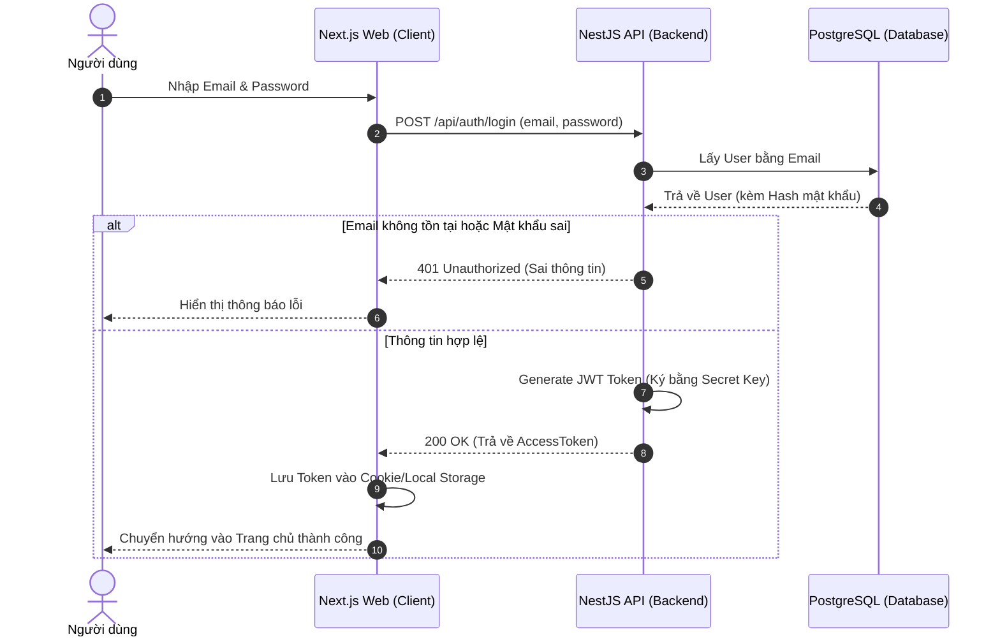
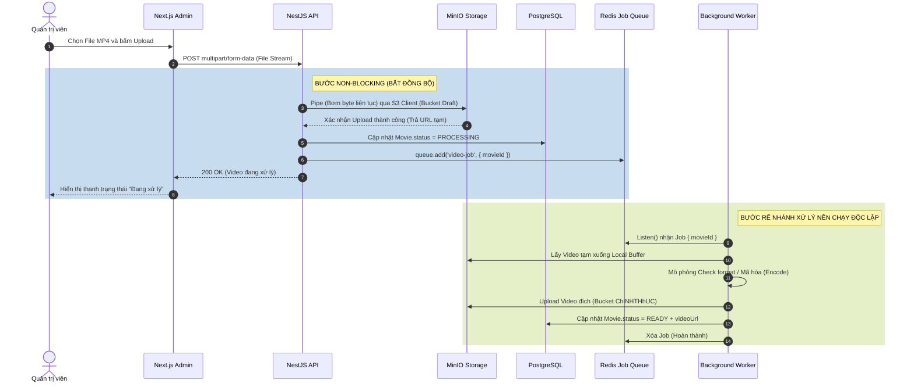
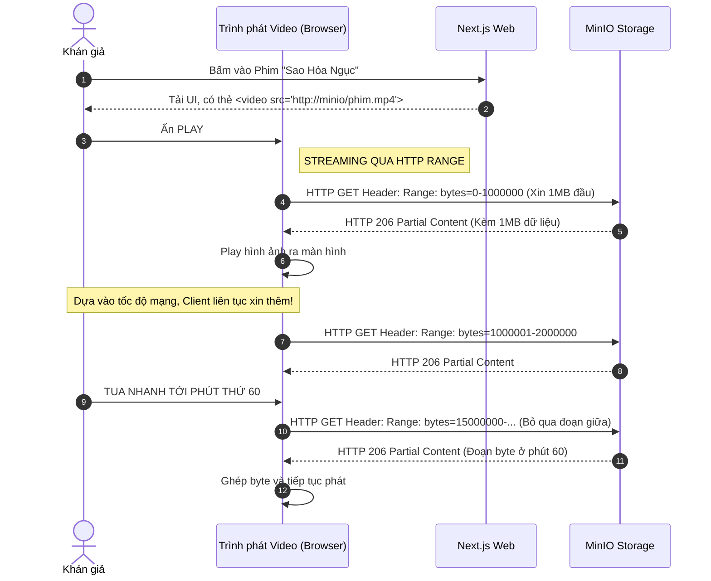
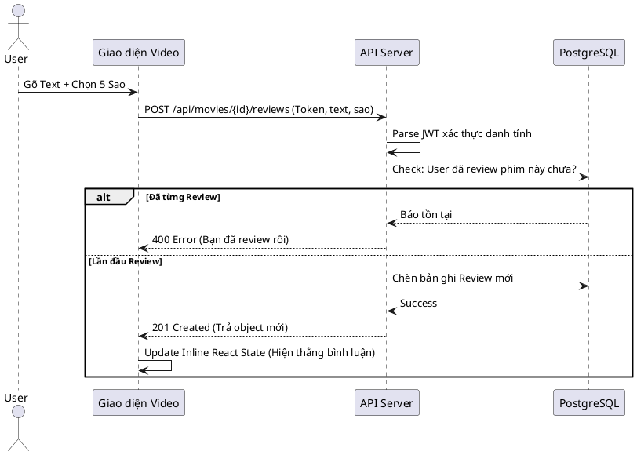

# CÁC BIỂU ĐỒ TUẦN TỰ (SEQUENCE DIAGRAMS) HỆ THỐNG NETFLAT

Tài liệu này cung cấp mã nguồn dạng PlantUML/Mermaid để vẽ Biểu đồ Tuần tự (Sequence Diagram). Bạn có thể copy mã nguồn này dán vào các trang web như `planttext.com` hoặc `mermaid.live` để render ra hình ảnh biểu đồ chèn vào file Word báo cáo đồ án.

---

## 1. Biểu đồ Tuần tự: Quy trình Xác thực & Đăng nhập (Auth Flow)
Biểu đồ này mô tả cách JWT Token được sinh ra và cấp phép cho người dùng truy cập an toàn.

**Đoạn mã Mermaid:**

---

## 2. Biểu đồ Tuần tự: Quy trình Admin Upload File & Xử lý Nền (Upload Pipeline)
Đây là biểu đồ quan trọng nhất thể hiện sức mạnh kiến trúc bất đồng bộ (Asynchronous) của Netflat.

**Đoạn mã Mermaid:**

---

## 3. Biểu đồ Tuần tự: Quy trình Stream (Xem phim)
Biểu đồ này giải thích cách người dùng stream phân đoạn bằng giao thức `HTTP 206 Partial Content`.

**Đoạn mã Mermaid:**

---

## 4. Biểu đồ Tuần tự: Đánh giá phim (Review Inline)
Quy trình gửi nhận xét và cập nhật trạng thái làm tươi ngay dưới trình phát chiếu của ứng dụng.

**Đoạn mã PlantUML (nếu cần vẽ bằng Text truyền thống):**
Mã này dành cho công cụ PlantUML (Dùng cú pháp khác xíu so với Mermaid).
